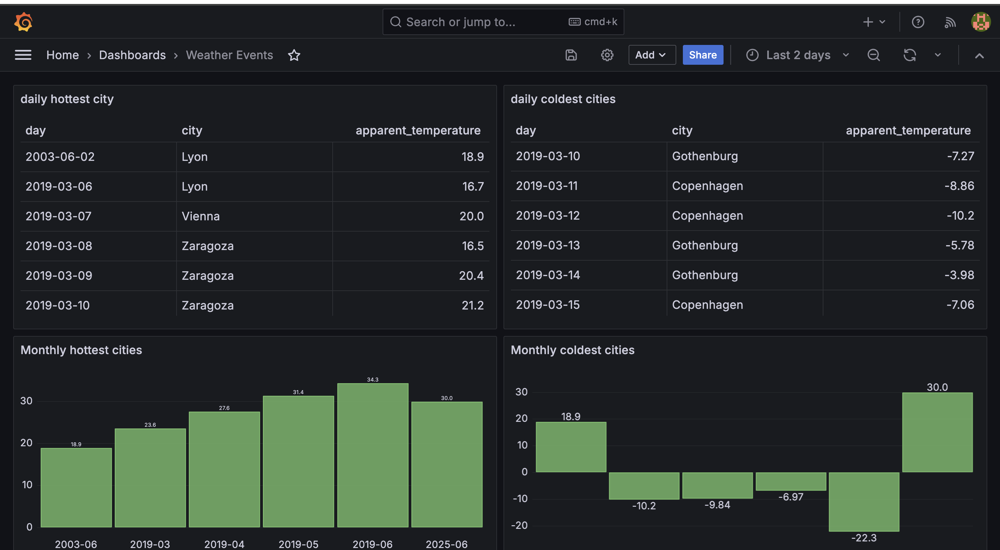

# MCI Big Data Challenge

## Description
This project is a Spring Boot application designed for processing weather data. It reads weather data, converts it to Protocol Buffers (proto) format, publishes it to a Kafka cluster, consumes the Kafka messages, and persists the data into a PostgreSQL database. Additionally, the application provides multiple RESTful endpoints to query weather information, including the most humid cities by day, and the hottest and coldest cities on a daily and monthly basis.

## Features
- **Data Processing Pipeline:** Converts weather data to proto and sends it to a Kafka cluster.
- **Database Integration:** Reads from Kafka and writes to PostgreSQL.
- **RESTful Endpoints:** Offers several endpoints to query weather data.
- **Grafana Dashboard:** Visualizes weather data through a comprehensive dashboard.

## System Architecture Diagram


## Getting Started

### Prerequisites
- Java 17 or newer
- Maven
- Docker (for Kafka and PostgreSQL containers)
- Grafana

### Installation
1. Clone the repository:
   ```sh
   git clone https://github.com/mhhio/mci-bigdata-challenge
   ```
2. Navigate to the project directory:
   ```sh
   cd mci-bigdata-challenge
   ```
3. Build the docker image:
   ```sh
   docker build -t weather-app .
   ```
4. Start application and other services the Kafka and PostgreSQL services (using Docker):
   ```sh
   docker-compose up -d
   ```


_if you want to run application without docker image please consider postgres url and kafka url in `application.properties`_

## Usage

### Publishing Data to Kafka
To publish data from a source JSON file to Kafka, use the following endpoint:
```
curl -F "file=@[path/to/json/file]" http://localhost:8080/pipeline/publish
```
_consider file size should be lower than 1GB_

### Querying Weather Data
- **Most Humid Cities Daily:**
  ```
  curl http://localhost:8080/api/weather/top-humid-cities
  ```
- **Hottest Cities Daily:**
  ```
  curl http://localhost:8080/api/weather/hottest-cities/daily
  ```
- **Hottest Cities Monthly:**
  ```
  curl http://localhost:8080/api/weather/hottest-cities/monthly
  ```
- **Coldest Cities Daily:**
  ```
  curl http://localhost:8080/api/weather/coldest-cities/daily
  ```
- **Coldest Cities Monthly:**
  ```
  curl http://localhost:8080/api/weather/coldest-cities/monthly
  ```

## Swagger UI
To access the Swagger UI for API documentation and testing, navigate to http://localhost:8080/swagger-ui.html in your web browser.

## Grafana Dashboard
